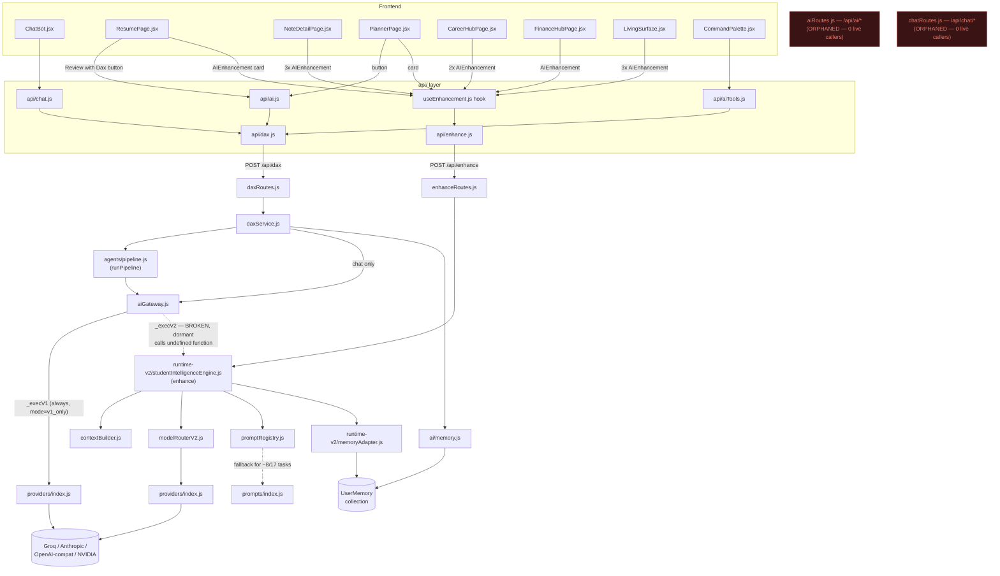

# DATAD — AI Architecture Report

**Scope:** analysis only. No files modified, no code removed, nothing refactored.
Every claim below is backed by a file:line citation or a direct grep/read result
I ran against the current working tree. Where I couldn't fully confirm something,
I say so explicitly rather than guess.

**Headline finding, stated up front:** DATAD runs **two independent, fully-built
AI orchestration pipelines** in production today. They are not cleanly separated
by purpose — they implement **the same ~14 features twice**, under different
names, on different infrastructure. They share a bottom layer (the same LLM
provider clients, the same `UserMemory` database collection, and — partially —
the same prompt content) but duplicate everything above that: routing, context
building, execution, and quota enforcement. One of the two also has a broken
internal switch that would crash if ever flipped on. Full evidence below.

---

## Current AI Architecture

Four HTTP surfaces are mounted (`server/index.js:73-78`); two are live, two
are orphaned; one live surface has a broken sub-mode.

| Surface | Status | Carries Dax identity? | Notes |
|---|---|---|---|
| `POST /api/dax` → `daxRoutes.js` → `daxService.js` | **Live — primary** | Yes | Chat, resume review (button), planner suggest (button), semantic search, case framework. |
| `POST /api/enhance` → `enhanceRoutes.js` → `runtime-v2/studentIntelligenceEngine.js` | **Live — parallel** | No | The `AIEnhancement` cards on 6 pages. Feature-overlaps `/api/dax` on 11 of 14 tasks (§4). |
| `/api/ai/*` → `aiRoutes.js` | **Orphaned** | N/A | Mounted, functional internals, zero live callers. |
| `/api/chat/*` → `chatRoutes.js` | **Orphaned** | N/A | Mounted, functional internals, zero live callers. |
| `aiGateway.js` internal V2 mode (`_execV2` etc.) | **Broken, dormant** | N/A | Calls an export that doesn't exist; unreachable only because `AI_GATEWAY_MODE` is unset. |

Both live surfaces share one thing structurally: the LLM provider layer
(`ai/providers/index.js`) and the memory database collection (`UserMemory`).
Everything above that — routing, context assembly, prompt resolution,
execution, quota bookkeeping — is implemented twice, independently, and (per
§4) has already drifted: the newer parallel system is missing the product's
Dax identity entirely and has at least two confirmed cases of running with no
system prompt at all.

The sections below (§1-4) are the full evidence trail behind this summary —
every component, every endpoint, every trace, with citations.

---

## 1. Every AI entry point in the frontend

| Component / Page | Hook / Service called | Client function | HTTP call |
|---|---|---|---|
| `ChatBot.jsx` (global launcher) | `api/chat.js` | `sendMessage()`, `getChatHistory()`, `clearChat()` | → `api/dax.js`: `daxChat()`, `getChatHistory()`, `clearChat()` |
| `DaxMemoryPanel.jsx` (Settings) | `api/ai.js` | `getDaxMemory()`, `updateDaxMemory()`, `forgetDaxMemory()` | `GET/PATCH/DELETE /api/dax/memory` |
| `ResumePage.jsx` | `api/ai.js` | `reviewResume()` | → `daxTask('review-resume')` → `POST /api/dax` |
| `ResumePage.jsx` | `AIEnhancement.jsx` (×2: `variant="card"`) | `useEnhancement('resume','review')`, `useEnhancement('resume','ats')` | `POST /api/enhance {page:'resume', action:'review'|'ats'}` |
| `PlannerPage.jsx` | `api/ai.js` | `plannerSuggest()` | → `daxTask('planner-suggest')` → `POST /api/dax` |
| `PlannerPage.jsx` | `AIEnhancement.jsx` | `useEnhancement('planner','optimize')` | `POST /api/enhance {page:'planner', action:'optimize'}` |
| `NoteDetailPage.jsx` | `AIEnhancement.jsx` (×3) | `useEnhancement('notes','summarize'|'flashcard'|'quiz')` | `POST /api/enhance` ×3 |
| `CareerHubPage.jsx` | `AIEnhancement.jsx` (×2: `card` + `minimal`) | `useEnhancement('career','roadmap')`, `useEnhancement('recommend','next')` | `POST /api/enhance` ×2 |
| `FinanceHubPage.jsx` | `AIEnhancement.jsx` | `useEnhancement('finance','advise')` | `POST /api/enhance {page:'finance', action:'advise'}` |
| `LivingSurface.jsx` (dashboard) | `AIEnhancement.jsx` (×3, per earlier grep) | `useEnhancement('dashboard', ...)` | `POST /api/enhance` ×3 |
| `CommandPalette.jsx` | `api/aiTools.js` | `semanticSearch()` | → `daxTask('search', ...)` → `POST /api/dax` |
| `AIToolsPage.jsx` *(unrouted — see Stabilization Report)* | `api/aiTools.js` | `summariseDoc`, `reviewResume`, `askCareerAdvice`, `semanticSearch`, `simulateInterview`, `compareCompanies` | all → `daxTask(...)` → `POST /api/dax` |
| `AdminCasesPage.jsx` | `api/ai.js` | `generateFramework()` | → `daxTask('case-framework')` → `POST /api/dax` |
| `AdminAIDashboardPage.jsx` | raw `fetch()` (not an `api/*` module — see Stabilization Report H1) | — | `GET /api/admin/ai/*` |
| `AdminAICenterPage.jsx` | (not traced in this pass — cost/usage dashboard, reads `AiUsage`/`RuntimeComparison` data, not itself an AI-triggering surface) | — | — |

**Confirmed dead client-side AI code (zero render path today):**
`ResumePage`'s two `AIEnhancement` calls and its one `api/ai.js` call are **both
live on the same page** — this is the concrete instance of the duplication
described below, not a hypothetical.

---

## 2. Every AI endpoint in the backend

All four are `app.use()`-mounted in `server/index.js` (lines 73–78) and none of
the four has been removed:

```
server/index.js:73   app.use('/api/dax',     require('./routes/daxRoutes'));
server/index.js:74   app.use('/api/enhance', require('./routes/enhanceRoutes'));
server/index.js:75   app.use('/api/chat',    require('./routes/chatRoutes'));
server/index.js:78   app.use('/api/ai',      require('./routes/aiRoutes'));
```

### `/api/dax` — `routes/daxRoutes.js`
- **Route:** `POST /` (generic task dispatch via `{task, ...payload}` body),
  `GET/PATCH/DELETE /memory`, `GET /chat/history`, `DELETE /chat`.
- **Controller:** `daxRoutes.js` itself — resolves `TASK_FEATURES[task]` for
  tier-gating, `TASK_QUOTA` for metering, then delegates.
- **Service:** `ai/daxService.js` — a `HANDLERS` map keyed by task name
  (`daxRoutes.js:46` calls into it; confirmed 14 handler keys, §3 below).
- **Runtime:** `ai/agents/pipeline.js` (`runPipeline`) for RAG-augmented tasks,
  or `ai/aiGateway.js` directly for chat (`daxService.js:465`).
- **Provider:** `ai/providers/index.js` → Groq / Anthropic / OpenAI-compatible / NVIDIA.
- **Memory:** `ai/memory.js` (`getUserMemory`, `formatMemoryContext`, `appendTopic`) — writes to `models/UserMemory`.
- **Prompt builder:** `ai/prompts/index.js` (9 templates) for some tasks;
  several handlers (e.g. `review-resume`, confirmed at `daxService.js:100`)
  build their system prompt inline via `withDaxIdentity(...)` instead.
- **Recommendation engine:** not used by this path.
- **Streaming:** **not implemented.** No `res.write`, no `text/event-stream`,
  no chunked response anywhere under `ai/` or `routes/` (grepped explicitly).

### `/api/enhance` — `routes/enhanceRoutes.js`
- **Route:** `POST /` only, body `{page, action, data}`.
- **Controller:** `enhanceRoutes.js` — resolves `ENHANCE_FEATURES[page:action]`
  for tier-gating, `ENHANCE_QUOTA` for metering (a **second, separately
  maintained** copy of the same gating/quota logic — see Risks).
- **Service/Runtime (fused):** `ai/runtime-v2/studentIntelligenceEngine.js`'s
  `enhance()` function — this single function *is* the controller, context
  builder, router, executor, and formatter. It directly imports and drives:
  `intentEngine`, `contextBuilder`, `capabilityEngine`, `modelRouterV2`,
  `promptRegistry`, `modelRegistry`, `promptVersionManager`,
  `responseVerifierV2`, `telemetryEngine`, `circuitBreaker`, `cacheLayer`,
  `costOptimizer`, `latencyOptimizer`, `knowledgeGraphAdapter`,
  `memoryAdapter`, `learningEngine` (all confirmed imports,
  `studentIntelligenceEngine.js:1-18`).
- **Provider:** `modelRouterV2.resolveProvider()` → `ai/providers/index.js`
  (`modelRouterV2.js:16`) — **the same provider module as `/api/dax`.** This
  is the one significant shared layer between the two systems.
- **Memory:** `ai/runtime-v2/memoryAdapter.js` — writes to the **same**
  `models/UserMemory` collection as `/api/dax`'s memory layer (`memoryAdapter.js:1`
  confirms `require('../../models/UserMemory')`), via a smaller, different
  function set (`saveMemory`/`getRecentMemory`/`searchMemory`). One memory
  store, two independent writer implementations. See Risks for a real bug found here.
- **Prompt builder:** `ai/runtime-v2/promptRegistry.js` — has its own registry
  (`PROMPT_REGISTRY`), but it is **populated by nothing**: `registerPrompt()`
  is defined and exported but never called anywhere in the codebase (grepped
  and confirmed). Falls back to `_resolveV1Prompt()`, which maps ~half its
  task names into `ai/prompts/index.js` (the V1 prompt file) and leaves the
  other half (`chat`, `review-resume`, `career-advice`, `planner-suggest`,
  `case-framework`, `interview-simulator`, `news-summary`, `moderate-post`)
  mapped to `null` (`promptRegistry.js:124-139`). For those tasks, `enhance()`
  runs with **`system: ''`** — confirmed by tracing the fallback chain to its
  final literal at `promptRegistry.js:185`.
- **Recommendation engine:** not used by this path — see §5, it's separate.
- **Streaming:** not implemented (same grep as above covers this file).

### `/api/ai` — `routes/aiRoutes.js` — **orphaned** (see §4)
- Full REST surface: `/summarise/:noteId`, `/review-resume`, `/case-framework`,
  `/planner-suggest`, `/career-advice`, `/interview-simulator`,
  `/compare-companies`, `/search`, `/index/:collection/:docId`, its own
  `/memory` (get/patch/delete).
- Internally calls `ai/agents/pipeline.js` → `ai/aiGateway.js` → V1 provider
  path, and `ai/memory.js` — **the same underlying runtime as `/api/dax`.**
  If reactivated, this would work; it is unreachable, not broken.

### `/api/chat` — `routes/chatRoutes.js` — **orphaned** (see §4)
- `POST /`, `GET /history`, `DELETE /`.
- Internally: `aiGateway.process({messages: [...]})` directly (V1 path),
  `ai/memory.js` for context. This file's `buildSystemPrompt()` is,
  line-for-line, the function that `daxService.js`'s chat handler now runs
  instead (`daxService.js:34-37`'s `deriveTopic()`/`HISTORY_WINDOW`/`TOPIC_MAX_LEN`
  constants are identical to `chatRoutes.js`'s — this was a faithful copy, not
  a rewrite, made when the client moved to `/api/dax`).

### Separate, non-overlapping: `/api/recommendations` — `routes/recommendationRoutes.js`
- Backed by `ai/recommendation-engine/` (dailyMission, goalProgress,
  weeklyReview, livingSurface, scoringEngineV2, dependencyGraph, etc.)
- **Confirmed this does not call any LLM provider** — grepped for
  `aiGateway`/`getProvider`/`require('../providers')` across the entire
  directory: zero matches. This is deterministic scoring/dependency logic
  (goal completion %, streaks, weighted recommendations), not a generative-AI
  system. **It is not part of the duplication described in this report** and
  should not be touched by any consolidation effort.

---

## 3. End-to-end traces

### Trace A — Dax Chat (the primary, most-used AI surface)
```
ChatBot.jsx
  → sendMessage(text)                         [api/chat.js]
  → daxChat(message)                          [api/dax.js]
  → POST /api/dax  { task: 'chat', message }
  → daxRoutes.js: router.post('/')            (tier check: none for chat; quota: not in TASK_QUOTA)
  → daxService.js: HANDLERS['chat'].execute() — actually chat is NOT in the
    HANDLERS map (confirmed: 14 keys listed in §2, no 'chat' key). Chat is
    handled by a dedicated branch inside daxRoutes.js/daxService.js before
    the HANDLERS dispatch (task === 'chat' short-circuits — see daxService.js:380-470).
  → getUserMemory(userId) + Task/Note/Resume context gather (daxService.js:380-393)
  → withDaxIdentity(...) system prompt composed with [Dax Memory] block
  → aiGateway.process({ messages: [...] })
  → aiGateway.js:91 — "messages array is V1-only format" — forced onto _routeV1
    regardless of AI_GATEWAY_MODE
  → _execV1 → ai/providers/index.js → getProvider(routeTask('chat')) → LLM call
  → reply persisted to ChatMessage, appendTopic() writes to UserMemory.recentTopics
  → response → daxRoutes.js → ChatBot.jsx
```
**Classification: Canonical.**

### Trace B — Resume Review (the duplicated case — exists on both pipelines)

**B1 (Dax-branded button, `api/ai.js`):**
```
ResumePage.jsx → reviewResume() [api/ai.js] → daxTask('review-resume') [api/dax.js]
  → POST /api/dax {task:'review-resume'}
  → daxRoutes.js → daxService.js HANDLERS['review-resume'] (daxService.js:75-112)
  → buildResumeRAGContext() + getUserMemory()
  → runPipeline({ systemPrompt: withDaxIdentity('...senior placement counsellor...'), ... })
  → ai/aiGateway.js → _execV1 → provider → LLM
  → JSON result with 3 specific improvements → ResumePage renders AIReviewPanel
```

**B2 (`AIEnhancement` card, same page, same time):**
```
ResumePage.jsx → <AIEnhancement page="resume" action="review" variant="card" />
  → useEnhancement('resume','review') → enhance('resume','review') [api/enhance.js]
  → POST /api/enhance {page:'resume', action:'review'}
  → enhanceRoutes.js → studentIntelligenceEngine.js: enhance()
  → contextBuilder.buildContext() + capabilityEngine.computeRequiredCapabilities()
  → modelRouterV2.routeRequest() → provider selection
  → promptRegistry.getPromptForIntent('review', 'resume-review')
    → V1_PROMPT_TASK_MAP['review-resume'] = null → _resolveV1Prompt returns null
    → falls to getPrompt('chat') → PROMPT_REGISTRY is empty (never seeded) → undefined
    → final fallback: { system: '', user: '', promptId: 'chat' }
  → providerInstance.generate({ system: '', user: buildUserPrompt(...), context: context.text, ... })
  → responseVerifierV2.verifyResponse() → formatted insight → AIEnhancement card renders
```
**Both run on the same page, on mount, independently, against the same
"review my resume" intent.** B1 carries the Dax identity and a hand-tuned
prompt. B2 runs with no system prompt for this specific action (confirmed via
the fallback trace above) and a generic capability-routed model choice.
**Classification: B1 = Canonical. B2 = Legacy** (duplicate of a Canonical
feature, functionally inferior for this specific task per the evidence above).

### Trace C — Notes Summarize (the example format requested)
```
NoteDetailPage.jsx
  → <AIEnhancement page="notes" action="summarize" data={enrichmentData} />
  → useEnhancement('notes','summarize')
  → enhance('notes', 'summarize', data)                    [api/enhance.js]
  → POST /api/enhance { page: 'notes', action: 'summarize', data }
  → enhanceRoutes.js: router.post('/')                      (tier-gate: FEATURE.AI_SUMMARISE, trial+)
  → studentIntelligenceEngine.js: enhance()
  → contextBuilder.buildContext(userId, { contextKeys:['memory','study',...], noteIds:[data.noteId] })
  → intentEngine (static: intent='summarize' from PAGE_ACTIONS, confidence 0.9)
  → modelRouterV2.routeRequest() → provider
  → promptRegistry.getPromptForIntent('summarize', 'notes-summary')
    → V1_PROMPT_TASK_MAP['news-summary'] = null (note: 'notes-summary' vs 'news-summary'
      naming mismatch is itself worth flagging — these do not appear to be the same key)
  → providerInstance.generate(...) → responseVerifierV2 → formatted → card renders
```
There is **no equivalent Dax-branded "summarise this note" button** anywhere
in `NoteDetailPage.jsx` — `summariseNote()` exists in `api/ai.js` and maps to
`daxTask('summarise-note', {noteId})`, and `daxService.js` HANDLERS has a
matching `'summarise-note'` entry (§2), but **nothing in the current
`NoteDetailPage.jsx` calls `summariseNote()` from `api/ai.js`** — I grepped the
file and only found the three `AIEnhancement` calls. So for this one feature,
`/api/dax`'s equivalent is built and reachable via the API layer, but has **no
live UI caller** — it's a backend capability with no frontend entry point,
which is a different situation from Trace B (where both are live and both
render).

**Correction made while verifying this trace, stated precisely rather than
left as a guess:** I initially suspected a `notes-summary`/`news-summary`
naming mismatch here. Checked directly and that guess was wrong — the real
`promptType` is `'summarise-note'` (`studentIntelligenceEngine.js:52`), which
**does** have an entry in `V1_PROMPT_TASK_MAP`: `'summarise-note': 'summariseNote'`
(`promptRegistry.js:125`). The actual bug is worse than a naming mismatch:
**`ai/prompts/index.js` has no `summariseNote` key.** I listed every key it
exports (16 total) and cross-checked all 10 non-null `V1_PROMPT_TASK_MAP`
targets against that list programmatically — `summariseNote` is the only one
that doesn't resolve; the other 9 are valid. So `_resolveV1Prompt('summarise-note', ...)`
returns `null` (`!v1Prompts[v1Key]` is `true`), and `notes:summarize` — the
action behind the *first* of `NoteDetailPage.jsx`'s three stacked
`AIEnhancement` cards — falls through to the same empty-system-prompt fallback
as `resume:review` in Trace B2. This isn't an intentionally-scoped gap like
the `null`-mapped tasks (chat, review-resume, etc.) — it's a broken reference
to a prompt template that was presumably renamed or never written.
**Classification: the `/api/enhance` path here = Canonical-by-default (it's
the only one actually wired to the UI for this feature). The `/api/dax`
`summarise-note` handler = Orphaned-from-the-frontend, though its route is live.**

---

## 4. Classification — every path, with evidence

| Path | Classification | Evidence |
|---|---|---|
| `/api/dax` (`daxRoutes.js` + `daxService.js`) | **Canonical** | Live entry point for Chat, Resume Review (button), Planner Suggest (button), Case Framework (admin), Semantic Search (⌘K). Carries the Dax identity (`withDaxIdentity`) built in the last major initiative (`DAX_NAMING.md`). Has the only working, bug-fixed memory continuity layer. |
| `/api/enhance` (`enhanceRoutes.js` + `runtime-v2/studentIntelligenceEngine.js`) | **Legacy** *(duplicate of Canonical, not complementary — see below)* | Feature-for-feature overlap with `/api/dax` confirmed for 11+ of 14 actions (§ below). Zero references to `withDaxIdentity` or "Dax" anywhere in `runtime-v2/*.js` (grepped, zero hits) — it predates or was built parallel to the Dax identity work and was never brought into it. For at least the `resume:review` action, demonstrably runs with an empty system prompt (Trace B2) where the Canonical path has a tuned one. |
| `aiGateway.js` V2 mode (`_execV2`/`_routeV2`/`_routeShadow`/`_routeHybrid`) | **Orphaned — and broken** | `AI_GATEWAY_MODE` is unset in `.env`, so `_currentMode` defaults to `'v1_only'` (`aiGateway.js:35`) — `_execV2` is unreachable in the current deployment. If it *were* reached, it would throw immediately: `_execV2` calls `v2Engine.processIntelligenceRequest()` (`aiGateway.js:293`), a function `studentIntelligenceEngine.js` does not export (confirmed: `module.exports = { enhance, healthCheck, PAGE_ACTIONS }`, no `processIntelligenceRequest`). This is dead, non-functional code, distinct from the `runtime-v2` module family itself (which is alive via the *other* door, `/api/enhance` calling `enhance()` directly). |
| `/api/ai` (`aiRoutes.js`) | **Orphaned** | Zero live call sites. Every client function that used to target `/api/ai/*` now calls `daxTask()` instead (traced `api/ai.js`, `api/aiTools.js` — both import `daxTask` from `api/dax.js`, neither makes a direct `/api/ai/*` request). Internals still functional (shares `runPipeline`/`aiGateway`/`ai/memory.js` with the Canonical path) — this is reachable-but-unreached, not broken. |
| `/api/chat` (`chatRoutes.js`) | **Orphaned** | `api/chat.js` (the only client module that could call it) imports exclusively from `api/dax.js` (confirmed: `import { daxChat, getChatHistory as daxGetChatHistory, clearChat as daxClearChat } from './dax'`). Zero requests reach `/api/chat/*`. Internals are a verbatim ancestor of `daxService.js`'s live chat handler — safe to remove once confirmed no external (non-web) client depends on it. |
| `ai/memory.js` (memory reader/writer used by `/api/dax`) | **Canonical** | Richer field set (specialization, career interests, target companies, strengths/weaknesses, contextSummary, bootstrap-from-profile logic). Bug-fixed in a previous session (Note/Task field-name bugs). |
| `ai/runtime-v2/memoryAdapter.js` (used by `/api/enhance`) | **Legacy** | Writes to the same `UserMemory` collection (`memoryAdapter.js:1`) but a narrower field set. **Contains a live bug**, found during this trace: `saveMemory()` sets `patch.lastIntent` and `patch.lastInteractionAt` as bare (non-`$set`) fields alongside a `$push` operator (`memoryAdapter.js:8-15`) — neither `lastIntent` nor `lastInteractionAt` exists in the `UserMemory` Mongoose schema, so under default `strict: true` these two writes are silently dropped on every call. Only the `recentTopics` push actually persists. Not fixing this (analysis only), but flagging it as evidence this path has had less scrutiny than the Canonical one. |
| `ai/recommendation-engine/` (`/api/recommendations`) | **Canonical — but out of scope** | Not a generative-AI system (no LLM provider calls, confirmed by grep). Deterministic scoring feeding `LivingSurface`'s goal-progress/weekly-review sections. Do not fold into any AI consolidation effort — it solves a different problem. |
| `ai/providers/index.js` (Groq/Anthropic/OpenAI-compat/NVIDIA clients) | **Canonical — shared by both systems** | Confirmed both `aiGateway.js` (`_execV1`, line 216) and `modelRouterV2.js` (line 16, via `resolveProvider`) import from the same `./providers` module. This is the one layer that does **not** need consolidation — it already is one. |
| `ai/prompts/index.js` (V1 prompt templates) | **Canonical — partially shared** | Used directly by some `/api/dax` handlers, and used as a fallback source by `runtime-v2/promptRegistry.js` (`promptRegistry.js:1, 191`) for roughly half of V2's task types. The other half get no prompt at all (see `V1_PROMPT_TASK_MAP` nulls). |

**Feature-overlap evidence (§2's two handler-key lists, side by side):**

| `/api/dax` task (`daxService.js`) | `/api/enhance` page:action (`studentIntelligenceEngine.js`) |
|---|---|
| `summarise-note` | `notes:summarize` |
| `flashcard-generate` | `notes:flashcard` |
| `quiz-generate` | `notes:quiz` |
| `resume-ats` | `resume:ats` |
| `review-resume` | `resume:review` |
| `finance-assist` | `finance:advise` |
| `career-advice` | `career:roadmap` |
| `interview-simulator` | `interview:coach` |
| `company-research` | `company:research` |
| `compare-companies` | `compare:companies` |
| `planner-suggest` | `planner:optimize` |
| `dashboard-insights` | `dashboard:view` / `dashboard:recommend` |
| `case-framework` | `study:case-framework` |
| *(no equivalent)* | `dashboard:detect-problems`, `recommend:next` |

11 of 14 `/api/dax` tasks and 11 of 17 `/api/enhance` actions name-match to the
same underlying feature. This is not "two systems serving different jobs" —
per your instruction to prove rather than assume, I looked for a functional
split and did not find one. The honest read is: two teams (or two sessions)
built the same feature set on two different runtimes, and the frontend now
calls both, sometimes on the same page.

---

## 5. Request Flow Diagram



*(Rendered version available if you'd like it as a standalone diagram; the
above is valid Mermaid and will render in most markdown viewers, GitHub included.)*

### Plain-text version of the two live paths

```
CANONICAL (Dax-branded features):
  Page/Component → api/{ai,aiTools,chat}.js → api/dax.js:daxTask()/daxChat()
  → POST /api/dax → daxRoutes.js → daxService.js (HANDLERS or chat branch)
  → agents/pipeline.js OR aiGateway.js directly → aiGateway._execV1 (always —
    V2 mode is unreachable) → providers/index.js → LLM
  → ai/memory.js reads/writes UserMemory

LEGACY (AIEnhancement cards):
  Page → components/common/AIEnhancement.jsx → hooks/useEnhancement.js
  → api/enhance.js:enhance() → POST /api/enhance → enhanceRoutes.js
  → runtime-v2/studentIntelligenceEngine.js:enhance() [does its own
    context-build, routing, prompt-resolution, provider-call, verification
    all inline] → providers/index.js → LLM
  → runtime-v2/memoryAdapter.js reads/writes the SAME UserMemory collection

ORPHANED (unreachable from any current client code path):
  aiRoutes.js  (/api/ai/*)   — internals still call the Canonical runtime
  chatRoutes.js (/api/chat/*) — internals are the ancestor of the Canonical chat handler
```

---

## 6. Canonical Components

- `client/src/api/dax.js` — the actual client transport; everything else in
  `api/ai.js` / `api/aiTools.js` / `api/chat.js` is a thin renamed wrapper over it.
- `server/routes/daxRoutes.js` + `server/ai/daxService.js` — live controller/service.
- `server/ai/aiGateway.js` — **but only its V1 path** (`_execV1`/`_routeV1`);
  the V2 switch inside this same file is broken (§4).
- `server/ai/agents/pipeline.js`, `server/ai/runner.js`, `server/ai/router.js`
  — the execution chain V1 actually uses.
- `server/ai/providers/index.js` and everything under `server/ai/providers/`
  — shared by both systems; not in question.
- `server/ai/memory.js` — richer, bug-fixed, actively maintained memory layer.
- `server/ai/prompts/index.js` — carries `withDaxIdentity()` composition; the
  identity-bearing prompt source.
- `client/src/components/chat/ChatBot.jsx`, `client/src/components/common/DaxMemoryPanel.jsx`
  — the UI surfaces that actually say "Dax" and match the product's stated identity.

## 7. Legacy Components

*(Legacy = superseded by a Canonical equivalent, not yet removed. Distinct from
Orphaned = literally unreachable.)*

- `server/routes/enhanceRoutes.js` + `server/ai/runtime-v2/studentIntelligenceEngine.js`
  and its full supporting cast (`contextBuilder`, `capabilityEngine`,
  `modelRouterV2`, `promptRegistry`, `modelRegistry`, `promptVersionManager`,
  `responseVerifierV2`, `telemetryEngine`, `circuitBreaker`, `cacheLayer`,
  `costOptimizer`, `latencyOptimizer`, `knowledgeGraphAdapter`, `memoryAdapter`,
  `learningEngine`) — **live, not orphaned, but duplicative of Canonical per
  the evidence in §4.** This is the one genuinely hard call in this report: it
  is architecturally more sophisticated in places (capability-based routing,
  circuit breaker, response verification, telemetry, caching) than the
  Canonical path. It is also unbranded, incompletely prompted for several
  tasks, and disconnected from the product's actual AI identity. See
  Recommended Final Architecture for how I'd reconcile this rather than just
  delete the more advanced infrastructure.
- `client/src/components/common/AIEnhancement.jsx`, `client/src/hooks/useEnhancement.js`
  — the UI-side callers of the above.
- `client/src/api/enhance.js` — thin wrapper, moves with it.

## 8. Orphaned Components

- `server/routes/aiRoutes.js` — 0 live callers, confirmed by tracing every
  client `api/ai.js`/`api/aiTools.js` function to its actual request target.
- `server/routes/chatRoutes.js` — 0 live callers, confirmed the same way for `api/chat.js`.
- `server/ai/aiGateway.js`'s `_execV2`/`_routeV2`/`_routeShadow`/`_routeHybrid`
  functions — unreachable given current `AI_GATEWAY_MODE`, and broken if reached.
- `server/routes/aiRoutes.js.tmp` — already flagged in the Stabilization Report;
  not AI-functional, just debris.

---

## 9. Migration Plan
*(Presented as options — analysis only, no recommendation to act yet.)*

**Step 0 (prerequisite, no design decision required):** confirm no external
consumer (mobile app, partner API key, internal script) targets `/api/ai/*` or
`/api/chat/*` directly. If confirmed clean, §8's two route files can be removed
with effectively zero risk whenever you're ready — this doesn't depend on the
harder question below.

**The real decision — three paths, not two:**

**A. Standardize on `/api/dax` (Canonical), retire `/api/enhance`.**
Simplest, fastest, lowest risk. Loses the more advanced infra
(capability-routing, circuit breaker, response verification, caching,
telemetry) unless those specific pieces are cherry-picked into the V1 path
first. Recommended prerequisite: fix or seed the empty prompts (§4) *before*
retiring V2 — several `/api/enhance` actions may currently produce worse
output than their Dax equivalent, so a straight cutover to Canonical is likely
a quality improvement, not a regression, but should be spot-checked per
feature rather than assumed.

**B. Migrate `/api/dax`'s features onto the `runtime-v2` infrastructure,
re-branding it as Dax.** Keeps the more sophisticated routing/caching/verification
layer. Larger effort — every handler needs `withDaxIdentity()` wired into
`promptRegistry`, and the currently-empty prompt fallbacks (8 of 17 actions)
need real content written, not just inherited from V1.

**C. Keep both, but stop rendering both on the same page.** Lowest-effort,
does not resolve the underlying duplication, but immediately fixes the
user-visible symptom (§ UX_REVIEW.md's "AI chrome has crept back" finding) by
picking one engine per feature rather than one engine per *page section*.
Treat this as a stopgap, not a destination — the duplicated
routing/quota/memory-writer code keeps accruing drift either way.

I'm not recommending one of these over the others in this document — that's
the decision you said you wanted to make deliberately. Each has a real
trade-off (speed vs. infra maturity vs. effort), and I now have the evidence
to execute whichever you choose without further discovery work.

---

## 10. Risks

- **Prompt quality regression, already live, not hypothetical.** Trace B2
  shows `/api/enhance`'s resume-review runs with an empty system prompt today.
  Any user who happens to trigger the `AIEnhancement` card before the Dax
  button is already getting a worse answer than the product's other button
  provides for the identical request.
- **Divergent quota enforcement logic, same underlying counter.** Confirmed
  both `daxRoutes.js` and `enhanceRoutes.js` write to the same `AiUsage`
  document (`{user, dateKey}` compound key) — so there's no quota-bypass risk
  today. But `TASK_QUOTA` (daxRoutes) and `ENHANCE_QUOTA` (enhanceRoutes) are
  two independently-maintained sets of "which actions count against the daily
  limit." If someone updates one list without the other, metering silently
  diverges per-feature.
- **Silent data loss in `memoryAdapter.js`.** Two of its three write fields
  (`lastIntent`, `lastInteractionAt`) don't exist in the `UserMemory` schema
  and are dropped on every write (§4). Not urgent — `ai/memory.js`'s writer is
  unaffected — but worth knowing before treating `memoryAdapter.js` as a
  reliable second source of truth for anything beyond `recentTopics`.
- **`aiGateway.js`'s V2 switch is a loaded gun.** If anyone ever sets
  `AI_GATEWAY_MODE=v2_only`, `shadow`, or `hybrid` in an env file (e.g.
  copying `.env.example`, which per the Stabilization Report already lists
  more variables than the running `.env` has), every non-chat AI request
  through that path will throw immediately (`v2Engine.processIntelligenceRequest
  is not a function`). This should either be fixed or the dead modes removed
  — leaving a documented-but-broken feature flag is a foot-gun for whoever
  touches `.env` next.
- **A second, confirmed empty-prompt case — broader than initially found.**
  Trace C confirms `V1_PROMPT_TASK_MAP['summarise-note'] = 'summariseNote'`
  points at a key that does not exist in `ai/prompts/index.js` (verified
  against all 16 of that file's actual exported keys). This silently disables
  the system prompt for `notes:summarize` — the first of three stacked
  `AIEnhancement` cards on `NoteDetailPage.jsx`, one of the app's
  higher-traffic surfaces. Combined with the `resume:review` finding in Trace
  B2, this means the empty-prompt problem affects at least two live,
  user-facing features today, not one. I checked all 10 non-null map entries
  programmatically; only this one is broken — the rest resolve correctly.

---

## 11. Recommended Final Architecture

Stated as a target shape, not a prescription for how to get there — that's
Migration Plan §9's job, and the choice of path A/B/C is yours.

**One controller surface, one service, one runtime, two-tier by capability
rather than by history:**

```
POST /api/dax  { task, ...payload }
  → daxRoutes.js  (single tier-gate map, single quota map)
  → daxService.js (single HANDLERS map — today's 14 tasks, today's chat branch)
  → agents/pipeline.js (RAG-augmented tasks) or direct gateway call (chat)
  → aiGateway.js — ONE execution path, not V1/V2 branching. If the
    capability-routing / circuit-breaker / response-verification / caching
    infrastructure from runtime-v2 is worth keeping (a real "yes" is
    plausible given its maturity), it belongs *inside* this single path as
    an enhancement to _execV1, not as a second parallel path that may or may
    not be reached depending on an env var.
  → providers/index.js (already shared, no change needed)
  → ai/memory.js (already the more complete implementation — memoryAdapter.js's
    writer logic, if anything from it is worth keeping, should be merged in,
    not run alongside it)
```

Every prompt gets `withDaxIdentity()` composition — no exceptions, no path
where a feature reaches an LLM without it, since that's the one thing that
distinguishes "the product's AI" from "an AI feature."

`/api/enhance`, `/api/ai`, `/api/chat` all retire once their live functionality
(if any is chosen to be kept, per Migration Plan option B) is folded into the
single path above.

`ai/recommendation-engine/` stays exactly where it is — it was never part of
this problem.

---

*No files were modified in the production of this report.*
